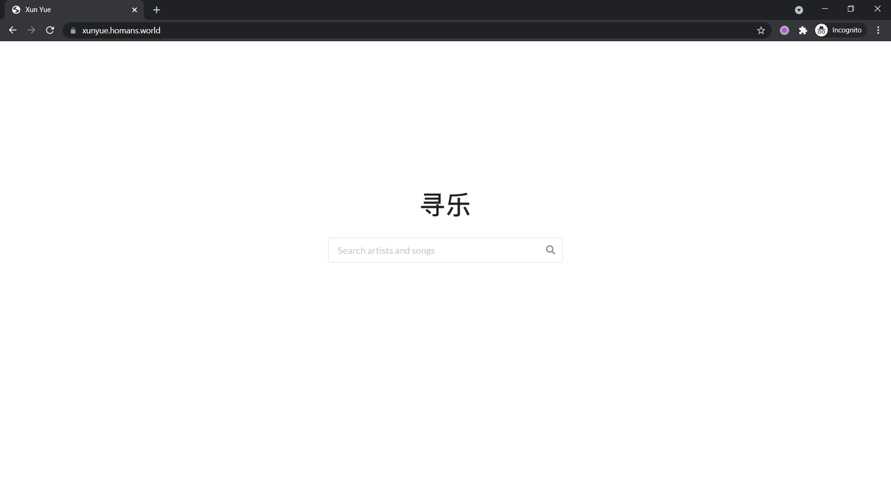
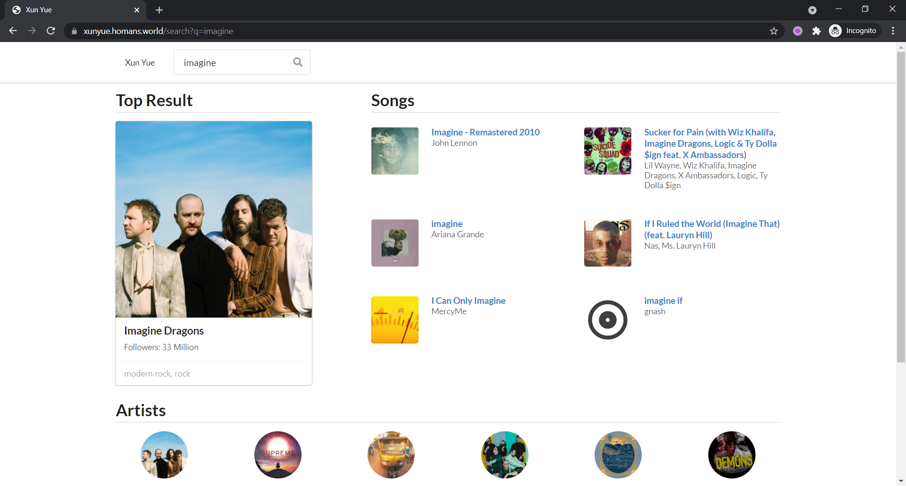
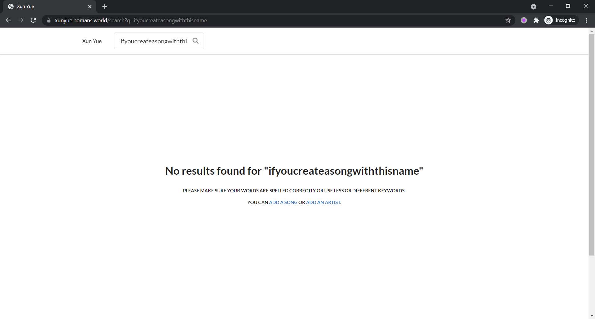
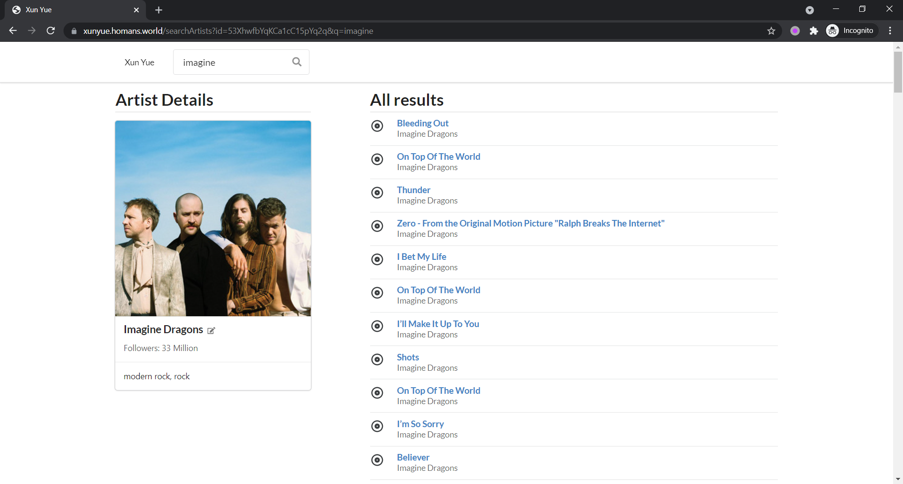
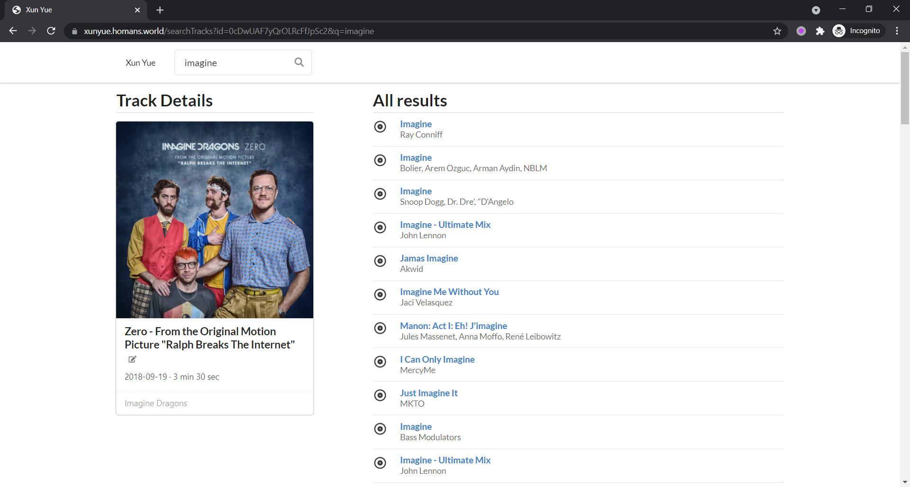
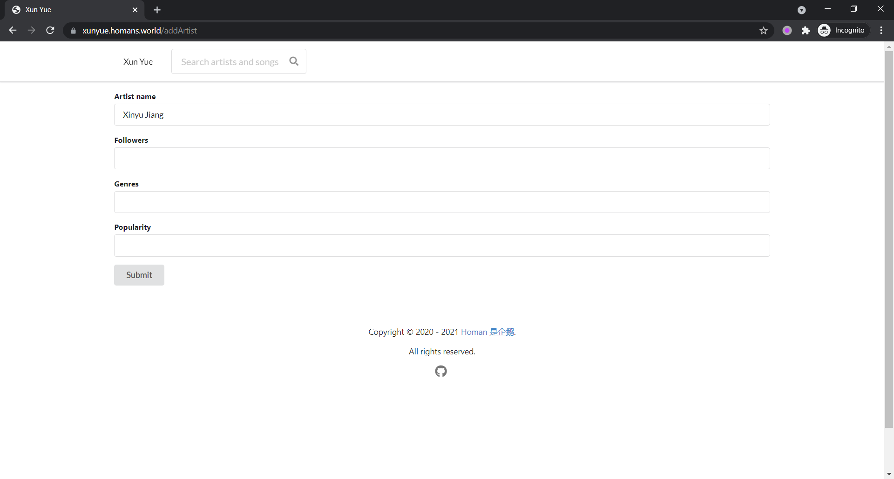

# xunyue-frontend

Xun Yue, a music-discovery app. This repository is the front end project for
Database Application course, using **ReactJS** and **Semantic UI React**.
The project was bootstrapped with [Create React App](https://github.com/facebook/create-react-app).
Backend's tech stack and database design are described under our backend
repository [xunyue-backend](https://github.com/homanw104/xunyue-backend).


## Features

* 主界面，引导用户搜索
  


* 搜索结果界面，包括**有限个**热门度最高的歌曲和歌手，以及一个最热门的歌手或歌曲，
  点击其中任意一个可以进入详情页面
  


* 如果没有结果，提示用户添加信息
  

  
* 艺人详情，显示同一个艺人的所有歌曲



* 歌曲详情，显示歌曲详情与其它相关的歌曲



* 添加、修改、删除歌曲信息界面




## Install Dependencies

Before running, run `npm install` in the project's root directory to download all required dependencies.

## Available Scripts

In the project directory, you can run:

### `npm start`

Runs the app in the development mode.\
Open [http://localhost:3000](http://localhost:3000) to view it in the browser.

The page will reload if you make edits.\
You will also see any lint errors in the console.

### `npm run build`

Builds the app for production to the `build` folder.\
It correctly bundles React in production mode and optimizes the build for the best performance.

The build is minified, and the filenames include the hashes.\
Your app is ready to be deployed!

See the section about [deployment](https://facebook.github.io/create-react-app/docs/deployment) for more information.


## Deployment Guide

我们的前端部署方式如下供参考。服务器环境：Ubuntu 20.04。
注：在大陆境内的服务器上部署非盈利性网页服务要求报备。

### Clone Project

On your server shell:

```shell
mkdir -p /var/www && cd /var/www
git clone https://github.com/homanw104/xunyue-frontend.git
```

Install dependency:

```shell
cd xunyue-frontend
npm install
```

### Update Project

Run the following to keep the repository to date with remote:

```shell
git pull origin
npm run build
```

### Setup Web Server

You may use any web server to serve contents at your preference. The static
resources are generated in the `build` folder under the project directory.
Below is our **Nginx** config file for reference, the config files allows
HTTPS requests by default.

```conf
server
{
    server_name xunyue.homans.world;

    listen 443 ssl;

    ssl_certificate /etc/letsencrypt/live/homans.world/fullchain.pem; # managed by Certbot
    ssl_certificate_key /etc/letsencrypt/live/homans.world/privkey.pem; # managed by Certbot
    include /etc/letsencrypt/options-ssl-nginx.conf; # managed by Certbot
    ssl_dhparam /etc/letsencrypt/ssl-dhparams.pem; # managed by Certbot

    root /var/www/xunyue-frontend/build;
    index index.html index.htm;

    location / {
        try_files $uri $uri/ /index.html;
    }

    location ^~ /assets/ {
        gzip_static on;
        expires max;
        add_header Cache-Control public;
    }

    error_page 500 502 503 504 /500.html;
    keepalive_timeout 10;
}

server
{
    if ($host = xunyue.homans.world) {
        return 301 http://$host$request_uri;
    } # managed by Certbot

    listen 80;
    server_name xunyue.homans.world;
    return 404; # managed by Certbot
}
```

## Team Members

* 杭海培：后端开发。
* 姜新宇：后端开发，数据库设计与文档撰写。
* 王皜民：前端开发，项目部署与文档撰写。
* 张式玉：后端开发。
* 张益嘉：前端开发。

该项目在通过存储在 GitHub 仓库来与组员进行协作， commit 记录完整地记录了我们的项目开发过程。

Link: <https://github.com/homanw104/xunyue-frontend>


## Licence

This project is licenced under GPL-3.
